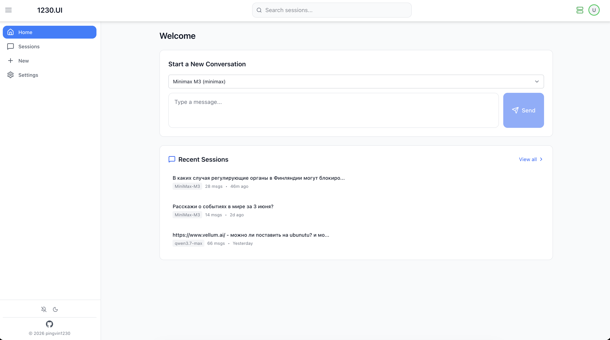
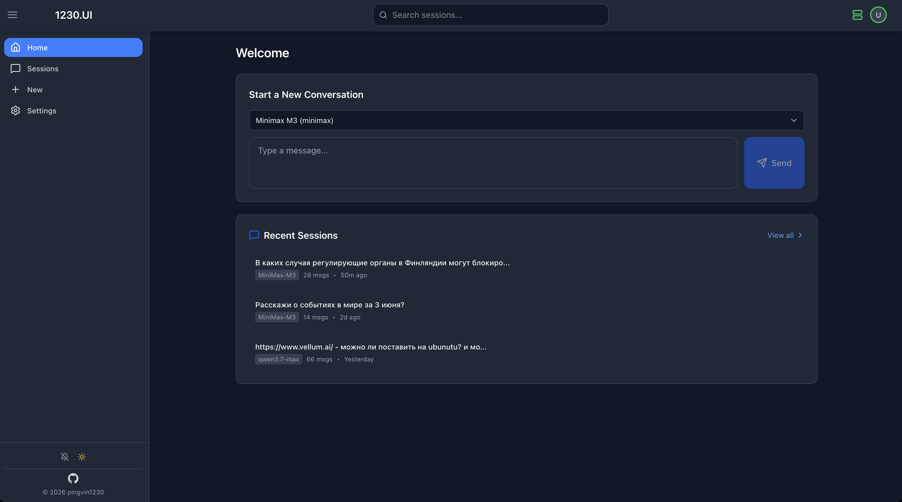
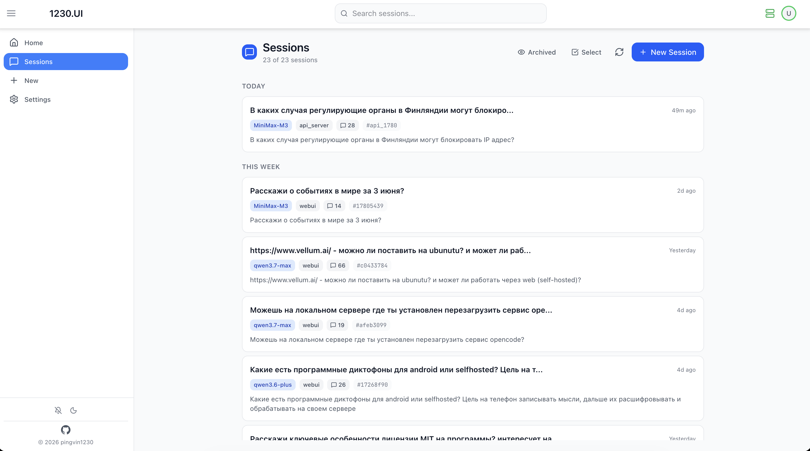
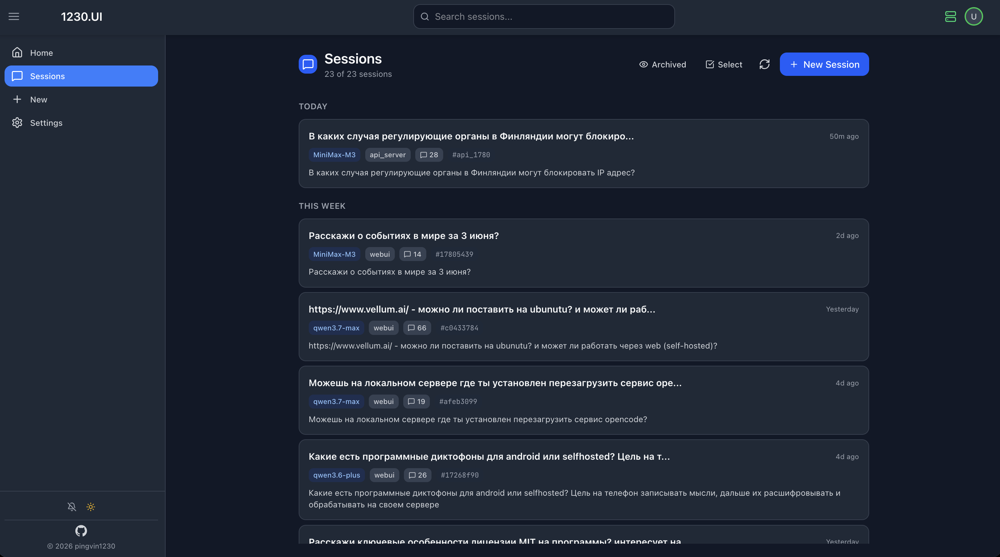
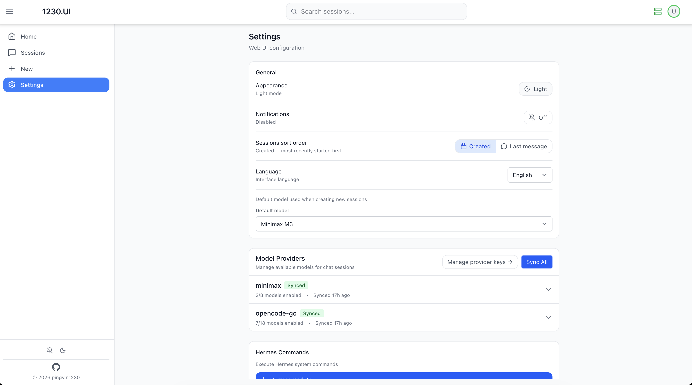
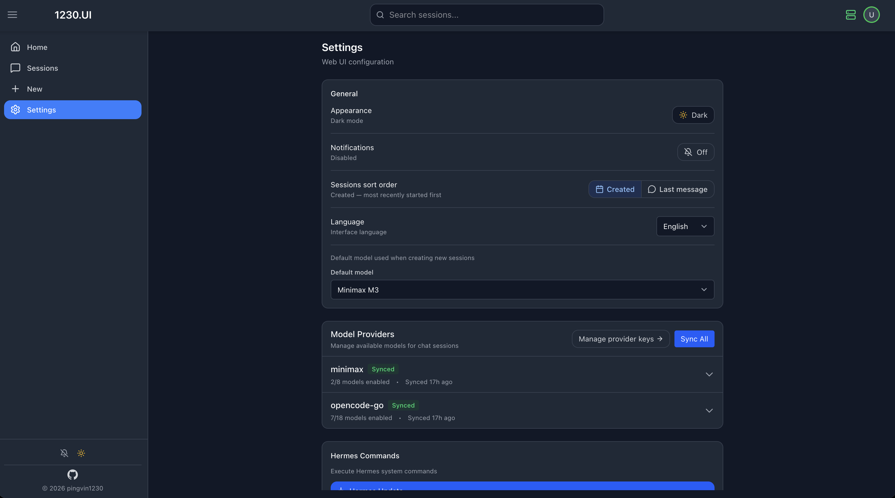

# 1230-UI — Hermes Web Interface

[](https://github.com/Pingvin1230/1230-ui/actions/workflows/ci.yml)

> **Status:** `v0.9.0` — Mobile layout overhaul (fixed scroll, sidebar overlay, MobileNav on foldables) · Chat UX improvements (clickable links, code block language labels, streaming cursor, Stop in header, prompt suggestions) · Session file indicators · Onboarding banner · Jargon-free UI terminology · File upload & agent file download · Assistants Phase 2 · Backend modularization.

Modern web interface for managing sessions and interacting with [Hermes Agent](https://github.com/anthropics/hermes-agent) through a browser.

## Features

- **Dashboard** — quick chat, recent sessions, Hermes API status
- **Session Management** — create, rename, pin, archive, delete, bulk actions, **swipe-to-delete** (mobile), **long-press to enter bulk mode** (mobile)
- **Real-time Chat** — streaming responses, markdown rendering, syntax highlighting, tool calls visualization
- **File Attachments** — attach files to a chat message via the paperclip button or by dragging them onto the chat area. Allowed: `.txt .md .py .js .ts .jsx .tsx .json .csv .yml .yaml .log .html .css .xml .sh .sql .pdf .png .jpg .jpeg .gif .webp`. Limits: 50 MB per file, 5 files per message. Files live in `data/uploads/<session_id>/` and are cleaned up automatically when the session is deleted.
- **Agent File Download** — when the agent creates or writes a file and mentions its absolute path in the response (e.g. `` `/tmp/report.md` ``), a download card appears directly inside the assistant message with the filename, size, and a Download button. Multiple files from one message are grouped in a collapsible container. Download cards persist across page reloads. If the file is deleted from disk, the endpoint returns `404` with a clear message.
- **Model Management** — enable/disable models, select default model
- **Provider Keys** — manage API keys for all bundled `api_key` providers from the UI (no terminal needed)
- **System Commands** — execute `hermes update` and `hermes doctor --fix`
- **Hermes API Status** — header indicator (green/red/gray) with live polling every 60s
- **Assistants** — named bundles (name, color, icon, model, style, depth, system prompt) that show up as tiles on the New Session page. Create / edit / archive / duplicate / restore from `/assistants`. Tile grid (1/2/3 cols), context menu (MoreVertical), tab filters with counts. Style badges (💬 Friendly · 📋 Formal · ✂️ Concise · 🎨 Creative) and depth indicators (●○○ Quick · ●●○ Standard · ●●● Thorough) on tiles. System prompt (≤ 4000 chars) injected into every chat turn. Editing a bundle that already has sessions **forks** it (the old version is archived; existing sessions keep the original reference). Duplicating opens the editor prefilled with the source — nothing is written until you click "Create copy"
- **Keyboard Shortcuts** — Ctrl+K (search), Ctrl+N (new session), Ctrl+Enter (send)
- **Browser Notifications** — alerts for new messages (toggle in sidebar)
- **Dark/Light Themes** — with saved preference (toggle in sidebar)
- **Internationalization** — 4 languages (English, Русский, Español, Deutsch) with auto-detection
- **Mobile-First UX** — 44 × 44 px touch targets, fluid `clamp(14px → 16px)` typography, iOS safe-area insets, icon-only header buttons on `< md`, `flex-wrap` confirm/header rows, no horizontal scroll at 360 px
- **Security** — rate limiting, XSS protection, CORS, security headers, rate-limited provider-key writes

## Screenshots

<p align="center">
  
  <br/>
  
  <br/>
  
  <br/>
  
  <br/>
  
  <br/>
  
</p>

<p align="center">
  <em>Dashboard with Quick Chat and Recent Sessions, Sessions list grouped by date, and Settings — light &amp; dark themes. Note the green <strong>Hermes API</strong> status indicator in the header (right of search) and the new quick toggles at the bottom of the sidebar.</em>
</p>

## Quick Start

```bash
# Clone repository
git clone https://github.com/Pingvin1230/1230-ui.git
cd 1230-ui

# Run installation script
./install.sh
```

Or manually:
```bash
git clone https://github.com/Pingvin1230/1230-ui.git
cd 1230-ui
npm install
cp .env.example .env
# Edit .env with your settings
npm run build
node server.js
```

Application will be available on port 3001.

## Documentation

- [Installation Guide](docs/INSTALLATION.md) — detailed installation and deployment
- [Configuration](docs/CONFIGURATION.md) — environment variables reference
- [Architecture](docs/ARCHITECTURE.md) — system design and tech stack
- [API Documentation](docs/API.md) — REST API reference
- [Development Guide](docs/DEVELOPMENT.md) — local development setup
- [Contributing](CONTRIBUTING.md) — contribution guidelines
- [Changelog](CHANGELOG.md) — version history

## Tech Stack

**Frontend:** React 19, TypeScript 6, Vite 8, Tailwind CSS v4, Zustand, React Router v7

**Backend:** Node.js, Express 5, better-sqlite3, multer

**Testing:** Vitest — `npm test` (22 tests)

**CI/CD:** GitHub Actions — lint + typecheck + test + build on every push/PR

**Infrastructure:** PM2, Nginx, Authelia, Let's Encrypt

## Requirements

- Node.js 22+ (18+ minimum)
- Python 3.x
- Hermes Agent (installed and configured)

## License

MIT License - see [LICENSE](LICENSE) file for details.

## Disclaimer

This software is provided "as is" without warranty of any kind. Use at your own risk.
